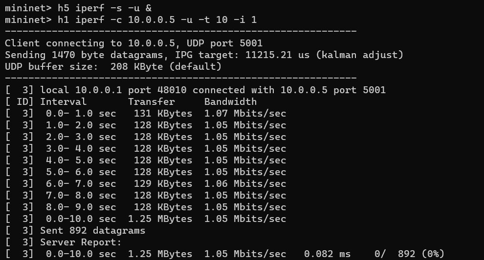

# connecting-sdn-slices
Networking 2 project

Members:<br>
- Davide Battaglia
- Ivan Donà

## Demo
### Setting up the network
Start up and log into the VM:<br>
```bash
vagrant up comnetsemu
vagrant ssh comnetsemu
```

Run the script to enable the RYU controllers to load the application:<br>
```bash
./runcontrollers.sh
```

In an other terminal, start the network with mininet:<br>
```bash
$ sudo python3 network.py
```

### Testing reachability
```bash
mininet> pingall
```


### Intra-slice communication (Hosts in the same slice)
Host 8 can send TCP packets to Host 3:<br>
```bash
mininet> h3 iperf -s &
mininet> h8 iperf -c 10.0.0.3 -t 10 -i 1
```


Host 1 can send UDP packets to Host 5<br>
```bash
mininet> h5 iperf -s -u &
mininet> h1 iperf -c 10.0.0.5 -u -t 10 -i 1
```


### Inter-slice communication (Hosts in different slices)
Host 2 (slice 1) can send TCP packets to Host 3 (slice 2) on port 3000:<br>
``` bash
mininet> h3 iperf -s -p 3000 &
mininet> h2 iperf -c 10.0.0.3 -p 3000 -t 10 -i 1
```


Host 1 (slice 1) can send TCP packets to Host 10 (slice 3) regardless of the port chosen:<br>
```bash
mininet> h10 iperf -s &
mininet> h1 iperf -c 10.0.0.10 -t 10 -i 1
```


Host 4 (slice 2) cannot send TCP packets to Host 6 (slice 1) on a different port:<br>
```bash
mininet> h4 iperf -s -p 4000 &
mininet> h6 iperf -c 10.0.0.4 -p 4000 -t 10 -i 1
```


Host 2 (slice 1) cannot send UDP packets to Host 7 (slice 2):<br>
```bash
mininet> h7 iperf -s -u &
mininet> h2 iperf -c 10.0.0.7 -u -t 10 -i 1
```


Flow table for switch 12 (connecting slice):<br>
```bash
$ sudo ovs-ofctl dump-flows s12
```


